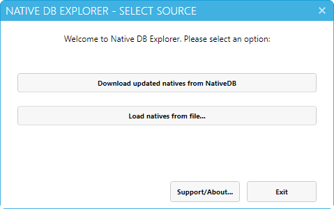
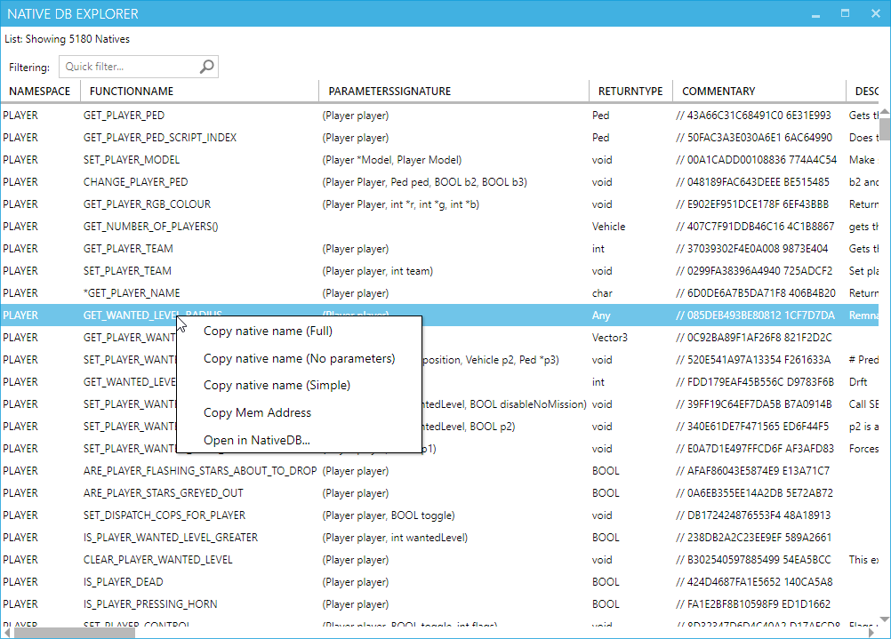
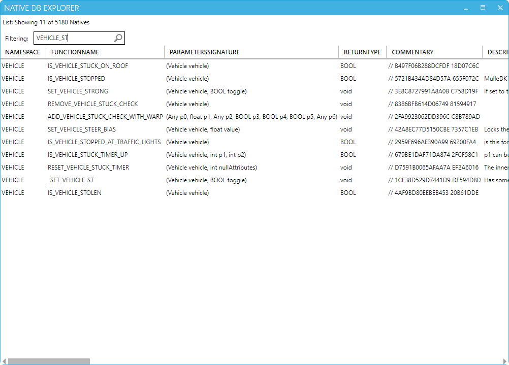
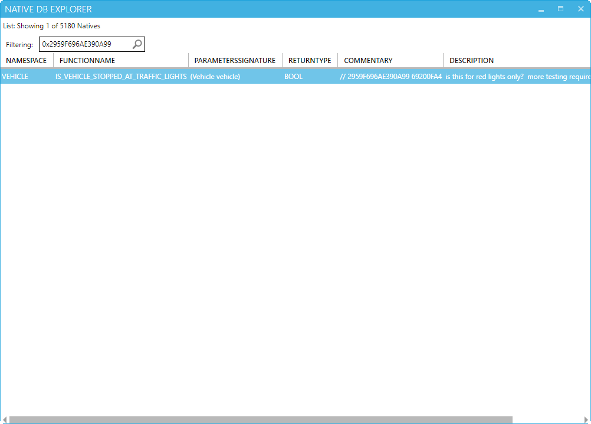

  <h1>GTA V NativeDB Explorer</h1>
  

    A fully featured desktop application where you can download and browse GTA V Native functions from NativeDB (for script developers) 
  

<h2 align="center">Download</h2>

https://github.com/Rbn3D/GTAV_NativeDB_Explorer/releases

<h2 align="center">Features</h2>

- Simple and intuitive interface
- Get latest natives directly from nativeDB or open a local copy
- Quick filter (Quicly find natives by function name, namespace or address!)
- Copy Native signature (Context menu)
- Copy Native address (Context menu)
- Open Native in NativeDB (Context menu)
- Custom ordering by clicking on column header

<h2 align="center">Issues?</h2>

https://github.com/Rbn3D/GTAV_NativeDB_Explorer/issues

<h2 align="center">Screenshots</h2>

